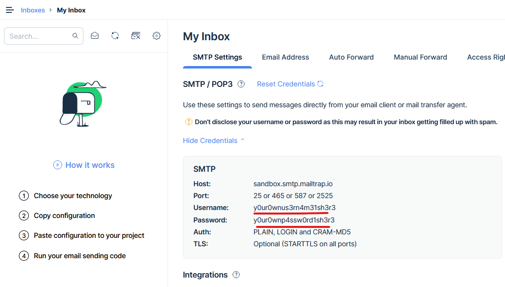

# IDS
STARTUP ALERT FOR PERSIONAL PC

For SMPT server use what ever you want, for MailTrap, use host  $smtpServer = 'sandbox.smtp.mailtrap.io' 

For smptusername and smptpassword enter the following:

Set Task Schedule to execute each time PC started

Warning on each time it Startup

